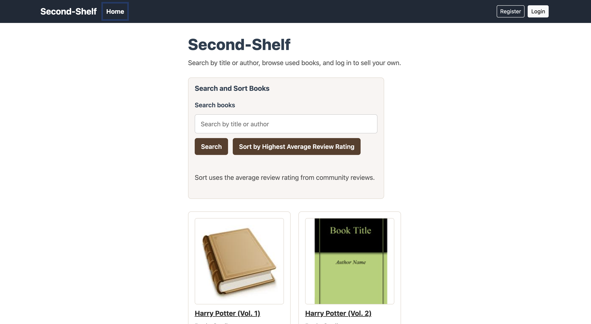
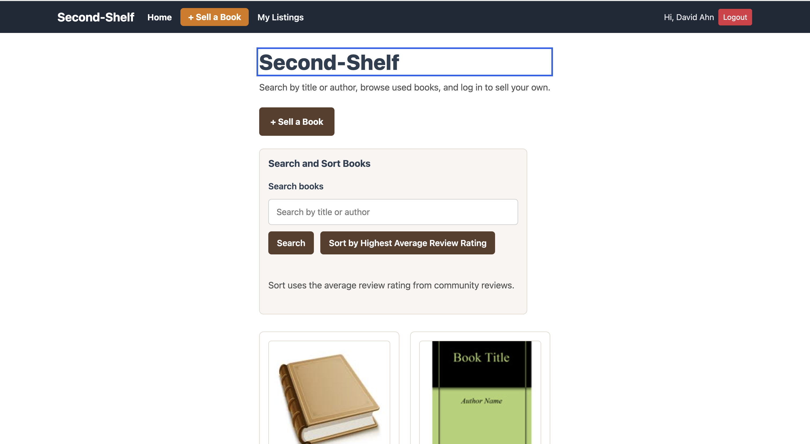
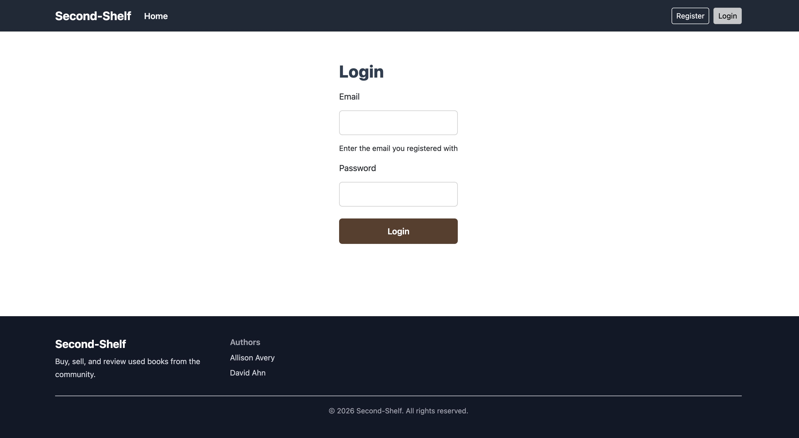
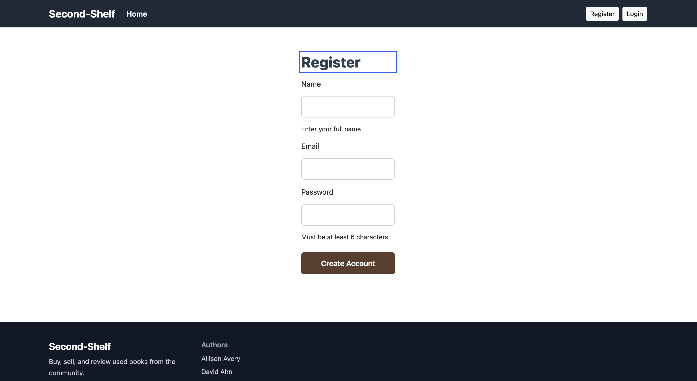
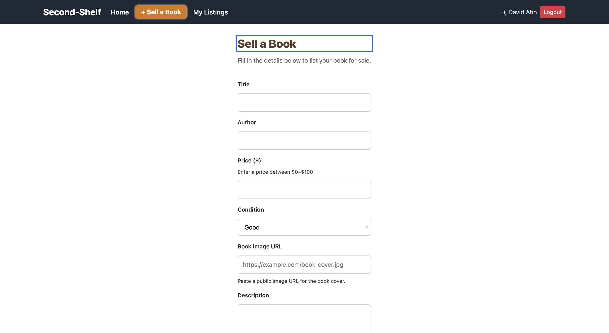
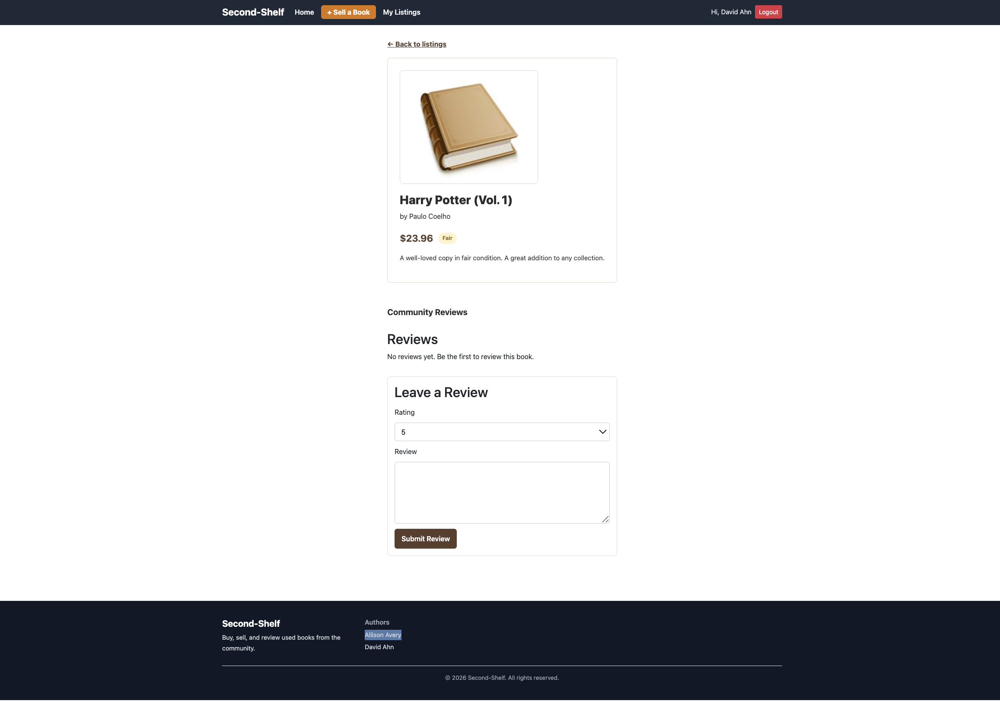
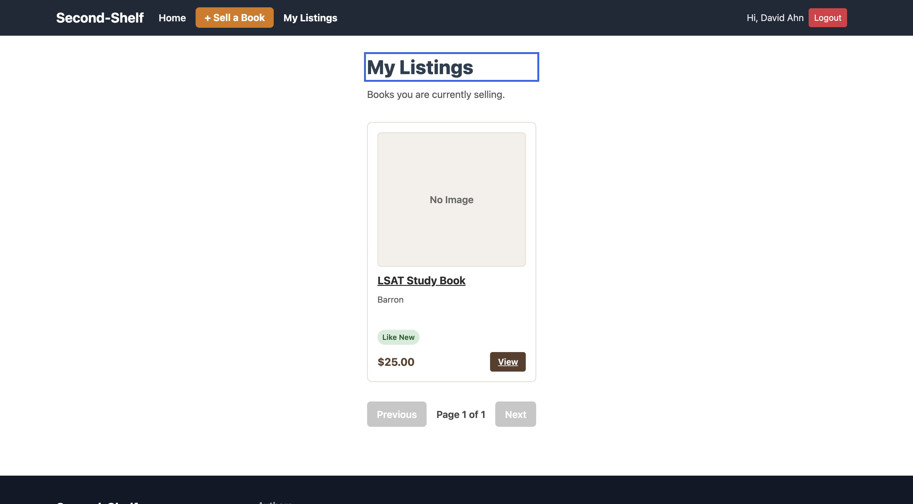

# Second-Shelf

A community marketplace for discovering and reviewing used books.

## Author 

David Ahn 

## Class Link
This project was completed as part of:
Web Development CS5610 (Spring 2026) Professor John Guerra Northeastern University

[(https://johnguerra.co/classes/webDevelopment_online_spring_2026/)]

## Design Documentation
Design Document:
[DesignDocument.md](DesignDocument.md)

## Demo
Public Deployment:
[https://project-4-second-shelf.onrender.com/]

GitHub Repository:
[https://github.com/CS-5610-Web-David-Alison/Project_3_second-shelf/tree/David_Ahn_Project_4_Usability_Update]

Application Walkthrough:
[https://youtu.be/3CvYk5Oe7SY]

Google Slides Presentation:
[https://docs.google.com/presentation/d/1QRzHVsBQ5N1guxiJ5P5ptqNMpx_RePCZPZXjvOEQnpo/edit?usp=sharing]


# Project Objective

Second-Shelf is a full stack web application to help users buy, sell, and review used books within a marketplace. Many students and readers have books they no longer need, or are looking for affordable options. This platform connects groups and enhances decision making through community reviews.

The platform is built with two independent modules:

- **Book Marketplace Engine** — handles listing and browsing books, including full CRUD operations on the Books collection. 

- **Review and Rating Engine** — enables readers to rate and review books, including full CRUD operations on the Reviews collection. 

By combining structured CRUD operations with community feedback, the system creates a practical and scalable book exchange platform.

The primary goals of this system are:

1. Provide full CRUD functionality for book listings.
2. Provide full CRUD functionality for user reviews.
3. Implement secure user authentication using Passport.
4. Allow users to manage their own listings and reviews.
5. Provide rating-based insights for better decision making.
6. Maintain clean separation between frontend, backend, and database layers.

Each module is fully independent — the app continues to function if either module is disabled. Together they demonstrate a complete full stack application using Node.js, Express, React with Hooks, and MongoDB.


## Usability Study Improvements

This version of the project includes changes made in response to usability testing evaluation. Key issues identified during testing included action discoverability, sorting confusion, lack of feedback after actions, weak visual guidance, and limited visual design. The following changes were implemented to address those findings:

- Added stronger “Sell a Book” calls to action
- Added search and clearer sorting language for books
- Added inline feedback and success/error messages
- Added confirmation modals for destructive actions such as logout and delete
- Added login required modals for protected flows
- Improved focus management and keyboard accessibility
- Added book images to strengthen visual design and scanning
- Improved empty states for My Listings and other flows

These changes were made to better satisfy the usability rubric, accessibility expectations, and design principles.

---

---

## Tech Stack

| Layer | Technology |
|-------|-----------|
| Frontend | React 18 (client-side rendering, Hooks) |
| Backend | Node.js + Express |
| Database | MongoDB (native Node.js driver) |
| Auth | Passport.js (local strategy) + express-session |
| Build tool | Vite |

---

## Core Features

- User registration and login
- Session based authentication
- Browse all book listings
- Search books by title or author
- Sort books by highest average review rating
- Add, edit, and delete book listings
- View personal listings in My Listings
- Create, edit, and delete reviews
- Review based rating display
- Book image support
- Confirmation and login-required modals
- Accessible keyboard navigation and focus handling

---

## Screenshots

### Home Pages



### Login and Register Pages



### Book Pages




---
## Usage

| Action | How |
|--------|-----|
| Browse books | Visit the home page to view listings |
| Search books | Use the search bar to search by title or author |
| Sort books | Use the sort control to view books by highest average review rating |
| View a listing | Click any book card to open the detail page |
| Log in | Click **Login** in the header and enter your credentials |
| Register | Click **Register** in the header and create an account |
| Sell a book | Log in, then click **Sell a Book** |
| Edit or delete a listing | Open one of your listings and use the listing controls |
| View your listings | Visit **My Listings** after logging in |
| Leave a review | Log in and use the review form on a book detail page |

---

## Instructions to Build

### Prerequisites

- [Node.js](https://nodejs.org) v18 or higher
- [MongoDB](https://www.mongodb.com) — local installation or a free [Atlas](https://www.mongodb.com/atlas) cluster
- [Git](https://git-scm.com)

Check your versions:
```bash
node -v
npm -v
git -v
```

---

### 1. Clone the repository

```bash
git clone https://github.com/CS-5610-Web-David-Alison/Project_3_second-shelf
cd Project_3_second-shelf
git checkout David_Ahn_Project_4_Usability_Update

```

---

### 2. Set up the backend

```bash
cd backend
npm install
```

Create your environment file:
```bash
cp .env.example .env
```

Open `.env` and fill in your values:
```
MONGO_URI=mongodb://localhost:27017
MONGO_DB_NAME=second_shelf
SESSION_SECRET=your_secret_key
PORT=3000
```

---

### 3. Seed the database

```bash
npm run seed
```

Expected output:
```
Seeded 1000 books, 1000 reviews, and 5 users.
```

> Test accounts: usernames `emma_reads`, `marcus_collects`, `bookworm99`, `pageturner`, `literarylife` — all with password `password123`

---

### 4. Start the backend

```bash
npm run dev
```

Expected output:
```
Connected to MongoDB
Server running on http://localhost:3000
```

Leave this terminal running.

---

### 5. Set up and start the frontend

Open a **new terminal tab**, then:

```bash
cd frontend
npm install
npm run dev
```

Expected output:
```
VITE ready in Xms
➜ Local: http://localhost:5173/
```

---

### 6. Open the app

Visit **[http://localhost:5173](http://localhost:5173)** in your browser.

---

## Project Structure

```
second-shelf/
  backend/          # Node.js + Express API
    config/         # MongoDB connection and Passport setup
    data/           # Database access layer (one file per collection)
    middleware/     # Auth middleware
    routes/         # Express route handlers
    scripts/        # Database seed script
    utils/          # Input validation helpers
  frontend/         # React client-side app
    src/
      api/          # Fetch calls to the backend API
      components/   # Reusable UI components (each with its own CSS file)
      pages/        # Page-level components
```

---

## Accessibility and Design Notes

This project includes improvements based on class notes and rubric expectations:

- semantic heading structure
- keyboard-accessible forms and controls
- focus management for pages and modals
- ARIA live regions for feedback messages
- clearer spacing, alignment, and hierarchy
- consistent visual design system
- improved typography and imagery for usability


## License

This project is licensed under the [MIT License](./LICENSE).